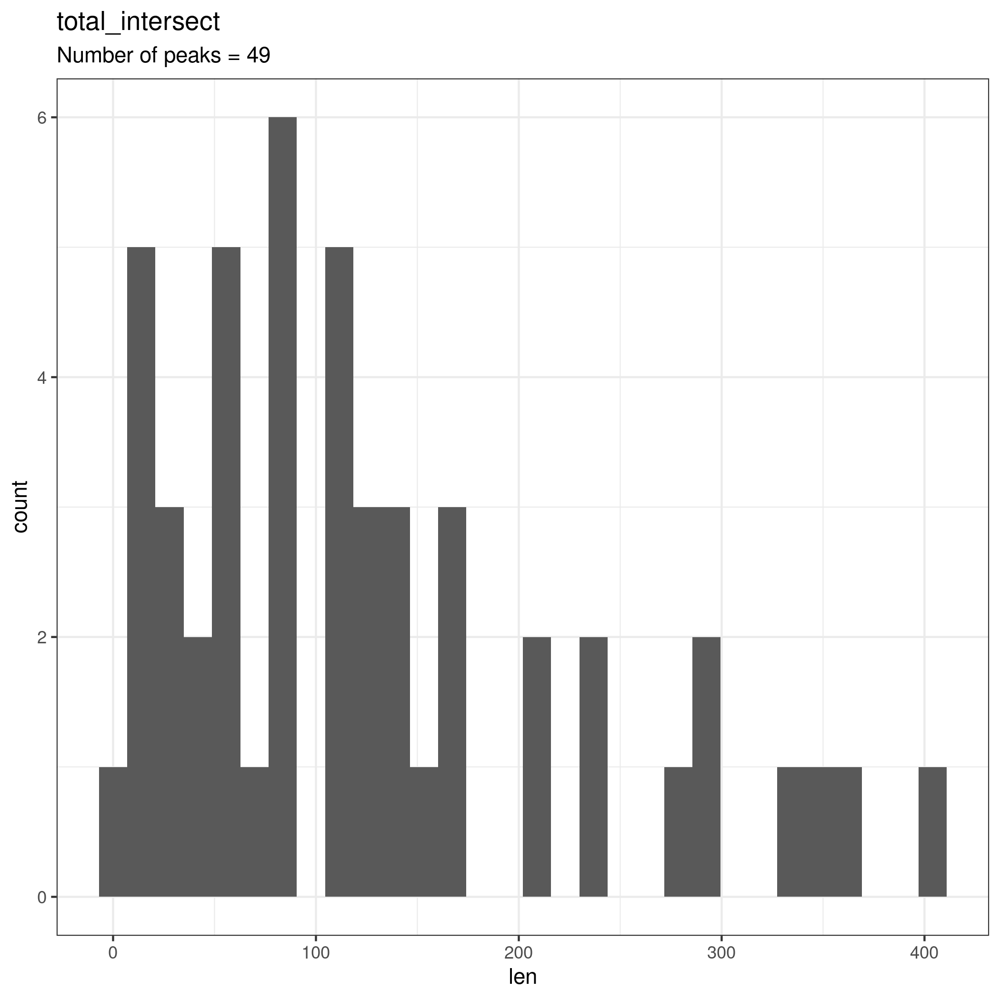
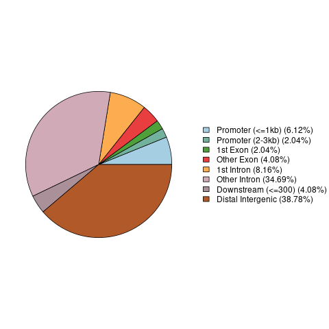
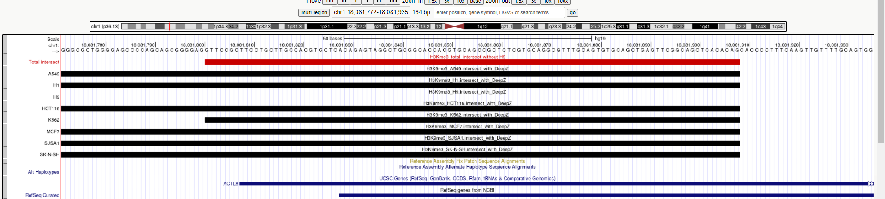
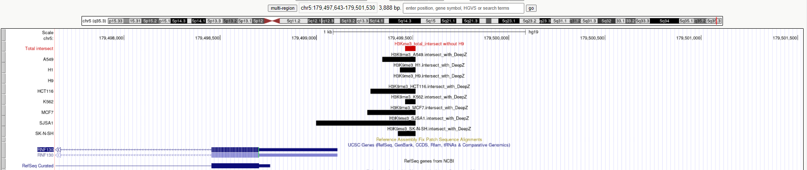

# hse_group_H3K9me3_ZDNA

Гистоновая метка: **H3K9me3**

Участники группы (организм, клеточная линия):
- Аюпов Шамиль (human, HCT116): https://github.com/ShamerD/hse21_H3K9me3_ZDNA_human
- Григорьев Пётр (human, SJSA1): https://github.com/petrusgrigus/hse21_H3K9me3_ZDNA_human
- Дудковская Анастасия (human, SK-N-SH): https://github.com/mintuit/hse21_H3K9me3_ZDNA_human
- Карташев Николай (human, H9): https://github.com/nickkartashev/hse21_H3K9me3_ZDNA_human
- Круглов Павел (human, MCF-7): https://github.com/Avogar/hse21_H3K9me3_ZDNA_human
- Миронов Алексей (mouse, MEL): https://github.com/alexmir1/hse21_H3K9me3_ZDNA_mouse
- Мячин Данил (human, K562): https://github.com/mdan2000/hse21_H3K9me3_ZDNA_human
- Сафонов Иван (human, A549): https://github.com/isaf27/hse21_H3K9me3_ZDNA_human
- Соколовский Алексей (human, A549): https://github.com/asokol123/hse21_H3K9me3_ZDNA_human
- Стрельцов Артём (human, H1): https://github.com/kekekekule/hse21_H3K9me3_ZDNA_human

Обзорная таблица индивидуальных экспериментов:

| Студент | Организм | Тип клеток | Структура ДНК | Эксперимент 1 | Количество пиков в эксперименте 1| Количество пиков в эксперименте 1 после фильтрации | Эксперимент 2 |  Количество пиков в эксперименте 2 | Количество пиков в эксперименте 2 после фильтрации | Количество пиков в структуре ДНК | Количество пиков в пересечении |
|--|--|--|--|--|--|--|--|--|--|--|--|
| Аюпов Шамиль | human | HCT116 | ZDNA_DeepZ | ENCFF832IOO | 113589 | 113276 | ENCFF158YTR | 62715 | 62388 | 19394 | 384 |
| Григорьев Пётр | human | SJSA1 | ZDNA_DeepZ | ENCFF921OTR | 41770 | 36813 | ENCFF157SWY | 36888 | 31989 | 19394 | 881 |
| Дудковская Анастасия | human | SK-N-SH | ZDNA_DeepZ | ENCFF051ZKJ | 33067 | 33065 | ENCFF231PXT | 9286 | 9286 | 19394  | 243 |
| Карташев Николай | human | H9 | ZDNA_DeepZ | ENCFF296PQE | 40403 | 39880 | ENCFF724VHG | 51357 | 51342 | 19394 | 511 |
| Круглов Павел | human | MCF-7 | ZDNA_DeepZ | ENCFF501UHK | 40249 | 40166 | ENCFF518MOR | 39216 | 39189 | 19394 | 528 | 
| Миронов Алексей | mouse | MEL | ZDNA_mouse_1 | ENCFF725BPX | 568 | 554 | ENCFF175TIH | 481 | 475 | 3258 | 3 |
| Мячин Данил | human | K562 | ZDNA_DeepZ | ENCFF963GZJ | 25411 | 25126 | ENCFF567HEH | 23889 | 23725 | 19394 | 369 |
| Сафонов Иван | human | A549 | ZDNA_DeepZ | ENCFF444EWQ | 60672 | 60384 | ENCFF811QUJ | 42936 | 42724 | 19394 | 522 |
| Соколовский Алексей | human | A549 | ZDNA_DeepZ | ENCFF836GHH | 55594 | 34218 | ENCFF283ZMN | 67493 | 45326 | 19394 | 226 |
| Стрельцов Артём | human | H1 | ZDNA_DeepZ | ENCFF678VNN | 69340 | 69129 | ENCFF918VFL | 87042 | 86674 | 19394 | 1051 |

Гистограммы распределений, а также pie-chart расположений участков индивидуальных экспериментов ищите в соответствующих репозиториях или в папке [images/](./images).

## 1. Анализ пересечений

Тотальные пересечения были получены с помощью утилиты `bedtools intersect`, соответствующий скрипт приведен в файле [intersection-files/intersect.sh](./intersection-files/intersect.sh).

*Замечание:* при тотальном пересечении всех наборов участков не остается ни одного участка, поэтому из пересечения была убрана часть экспериментов, а именно: эксперименты, соответсвующие клеточным линиям **MEL**, **H9**, один из двух экспериментов **A549**.

В результате был получен файл с тотальными пересечениями [intersection-files/total_intersect.bed](./intersection-files/total_intersect.bed). Ниже приведены описательные характеристики полученного набора.

### 1.1. Распределение длин участков.

Всего получено 49 участков.

### 1.2. Расположение относительно аннотированных генов.

Видно, что большинство участков попадает в межгенное пространство и в интроны.

## 2. Визуализация в геномном браузере.

Далее исходные участки и тотальные пересечения были провизуализированы в Genome Browser.

Ссылка на сессию: https://genome.ucsc.edu/s/ShamerD/H3K9me3_group

Черным выделены исходные участки, красным - тотальное пересечение.

Хотя большинство участков попадает в межгенное пространство и в интроны, ниже приведены примеры, когда пересечения наблюдаются вблизи генов:

1. Рядом с геном ACTL8, chr1:18,081,800-18,081,908:

2. Рядом с геном RNF130, chr5:179,499,461-179,499,515:

## 3. Ассоциация с генами.

Ассоциируем пересечения с ближайшими генами аналогично тому, как это делалось в индивидуальных заданиях.

В результате удалось ассоциировать 3 участка с 3 уникальными генами:
- ACTL8 - ассоциируется с раком кожи
- RNF130 - может играть роль в запрограммируемой смерти гемоцитобластов
- KCNJ15 - кодирует белок, который относится к ионным каналам (отвечает за транспорт)

Сами участки можно найти в файле [genes/total_intersect.bed.genes.txt](./genes/total_intersect.bed.genes.txt)

Также был проведен GO-анализ для набора уникальных генов при помощи сайта http://pantherdb.org/. Однако статистически значимых результатов найдено не было.

С текстовым результатом можно ознакомиться в файле [go_analysis/pantherdb_GO_analysis.txt](./go_analysis/pantherdb_GO_analysis.txt).

